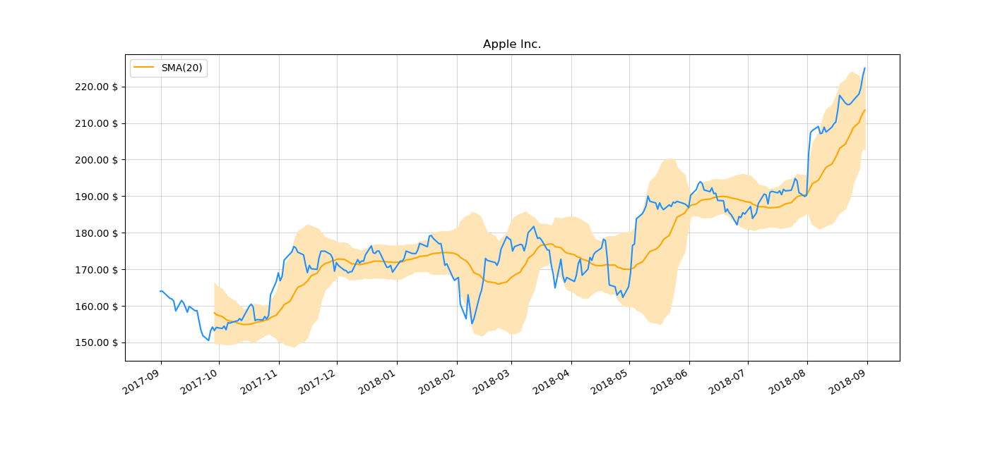
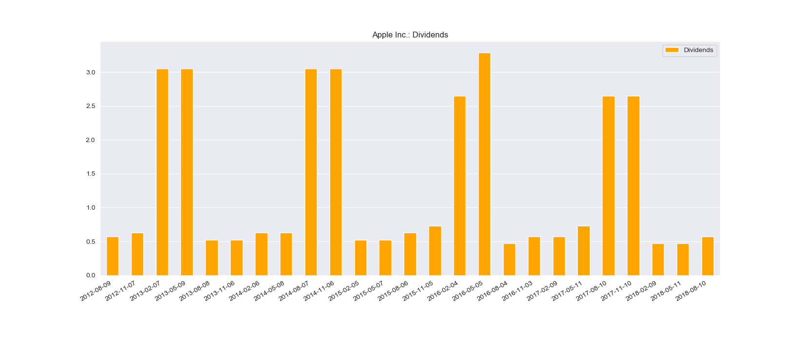

# Yahoo Finance Python Interface

In this folder you may find several examples (and many other have yet to come!) showing how the **yahoo-finance-pynterface** works.

 

## `getting_prices.py`
This script will download the timeseries of `APPLE` close daily price from September, 1st 2017 to August, 31st 2018, 
and then it will plot it in a line chart using the matplotlib package. 
In order to illustrate the implementation of *pandas*.**DataFrame** within the **yahoo-finance-pynterface**, 
the 20-periods simple moving avarege will be plotted on the same figure as well, as the picture below is showing.

 

## `getting_dividends.py`
This script will download the timeseries of `APPLE` dividends of the last 10 years. 
The result will be then plotted as bar chart using pandas' internal plotting system, as the picture below shows.
